# Merchant Deal System API Documentation

## 📋 Overview

The Merchant Deal System provides functionality for merchant-to-merchant **fixed point deal exchange**. Merchants can create deals with fixed point amounts, discover other merchants' deals, and exchange points through a structured, no-negotiation process.

## ✨ Key Features

- **Fixed Point Deals**: Merchants create deals with fixed point amounts (no negotiation)
- **Point-Based Exchange**: 1 Rupee = 10 Points conversion rate
- **Deal Discovery**: Find deals from other merchants with merchant logos
- **Automatic Point Transfer**: Seamless point exchange when deals are completed
- **Location-Based Filtering**: Deals can be filtered by city and location
- **Deal Management**: Create, update, delete deals
- **Real-time Notifications**: Instant notifications for deal activities
- **Point Tracking**: Complete audit trail of point usage
- **Merchant Logos**: Visual merchant identification in all API responses
- **Upfront Point Deduction**: Points are deducted immediately when deal is created
- **Filter-Based Actions**: Accept/reject requests using query parameters
- **Deal Deletion**: Merchants can delete their deals with automatic point refunds

## 🏗️ System Architecture

### Models

#### MerchantDeal

Main model for merchant deals with point-based system.

**Fields:**

- `merchant`: Foreign key to MerchantProfile
- `title`: Deal title
- `description`: Deal description
- `points_offered`: Points offered for the deal
- `points_used`: Points already used
- `points_remaining`: Available points
- `deal_value`: Monetary value (points/10)
- `category`: Deal category
- `status`: Deal status (active, inactive, completed)
- `expiry_date`: Deal expiry date

#### MerchantDealRequest

Model to track merchant deal requests with fixed point system.

**Fields:**

- `requesting_merchant`: Merchant requesting the deal
- `deal`: Deal being requested
- `points_requested`: Points requested (automatically set to deal's points_offered)
- `status`: Request status (pending, accepted, rejected)
- `message`: Request message

**Fixed Point Logic:**

- Points requested must exactly match deal's points_offered
- No negotiation or counter-offers allowed
- System automatically sets points_requested = deal.points_offered

#### MerchantDealConfirmation

Model for confirmed merchant deals.

**Fields:**

- `deal`: Associated deal
- `merchant1`: Deal creator
- `merchant2`: Deal requester
- `points_exchanged`: Points to be exchanged
- `status`: Confirmation status (pending, confirmed, completed)

#### MerchantPointsTransfer

Model for points transfer between merchants.

**Fields:**

- `from_merchant`: Sender merchant
- `to_merchant`: Receiver merchant
- `points_amount`: Points transferred
- `transfer_fee`: Transfer fee
- `net_amount`: Net amount after fees
- `status`: Transfer status (pending, completed, failed)

#### DealPointUsage

Model to track how deal points are used.

**Fields:**

- `deal`: Associated deal
- `from_merchant`: Merchant using points
- `to_merchant`: Merchant receiving points
- `usage_type`: Type of usage (exchange, discount, transfer)
- `points_used`: Points used

## 🚀 API Endpoints

### 💼 Merchant Deals

#### Create Deal

```http
POST /api/custom_auth/v1/merchant-deals/
```

**Description:** Create a new merchant deal.

**Authentication:** Required (JWT Token - Merchant only)

**Request Headers:**

```
Authorization: Bearer <jwt_token>
Content-Type: application/json
```

**Request Body:**

```json
{
  "title": "Food Delivery Service",
  "description": "Looking for reliable delivery partner for food delivery service",
  "points_offered": 500.0,
  "category": 1,
  "expiry_date": "2024-01-31T23:59:59Z",
  "preferred_cities": ["Mumbai", "Delhi", "Bangalore"],
  "terms_conditions": "Must have delivery vehicles and experienced staff"
}
```

**Important Notes:**

- **Points are deducted immediately** from merchant's wallet when deal is created
- Deal becomes active immediately after creation
- Points are locked in the deal until completion or expiry
- If no category provided, merchant's default category is automatically assigned
- Deal value is auto-calculated (points_offered / 10)

**Response:**

```json
{
  "id": 1,
  "merchant": 1,
  "merchant_name": "Pizza Palace",
  "merchant_logo": "http://localhost:8000/media/merchant/logo/pizza_logo.jpg",
  "title": "Food Delivery Service",
  "description": "Looking for reliable delivery partner",
  "points_offered": 500.0,
  "points_used": 0.0,
  "points_remaining": 500.0,
  "deal_value": 50.0,
  "category": 1,
  "category_name": "Food & Beverage",
  "status": "active",
  "expiry_date": "2024-01-31T23:59:59Z",
  "is_expired": false,
  "request_count": 0,
  "confirmation_count": 0,
  "create_time": "2024-01-01T10:00:00Z"
}
```

#### Get My Deals

```http
GET /api/custom_auth/v1/merchant-deals/
```

**Description:** Get deals created by the current merchant.

**Authentication:** Required (JWT Token - Merchant only)

**Query Parameters:**

- `status`: Filter by deal status (active, inactive, completed)
- `category`: Filter by category ID
- `page`: Page number for pagination
- `page_size`: Number of results per page

**Response:**

```json
{
  "count": 5,
  "next": null,
  "previous": null,
  "results": [
    {
      "id": 1,
      "merchant": 1,
      "merchant_name": "Pizza Palace",
      "merchant_logo": "http://localhost:8000/media/merchant/logo/pizza_logo.jpg",
      "title": "Food Delivery Service",
      "points_offered": 500.0,
      "points_remaining": 500.0,
      "status": "active",
      "request_count": 3,
      "confirmation_count": 1,
      "create_time": "2024-01-01T10:00:00Z"
    }
  ]
}
```

#### Delete Deal

```http
DELETE /api/custom_auth/v1/merchant-deals/{id}/
```

**Description:** Delete a merchant deal with automatic point refunds.

**Authentication:** Required (JWT Token - Deal creator only)

**Request Headers:**

```
Authorization: Bearer <jwt_token>
```

**Important Notes:**

- Only the deal creator can delete their own deals
- Cannot delete deals with pending requests
- Cannot delete deals with confirmed/completed transactions
- Unused points are automatically refunded to merchant's wallet
- Complete audit trail is maintained

**Success Response:**

```json
{
  "message": "Deal \"Sample Deal\" deleted successfully"
}
```

**Error Responses:**

```json
{
  "error": "You can only delete your own deals"
}
```

```json
{
  "error": "Cannot delete deal with 2 pending requests. Please handle all requests first."
}
```

```json
{
  "error": "Cannot delete deal with 1 confirmed/completed transactions. Deal is already in use."
}
```

#### Get Deal Usage History

```http
GET /api/custom_auth/v1/merchant-deals/{id}/usage-history/
```

**Description:** Get point usage history for a deal.

**Response:**

```json
{
  "results": [
    {
      "id": 1,
      "deal_title": "Food Delivery Service",
      "from_merchant_name": "Pizza Palace",
      "to_merchant_name": "Delivery Co",
      "points_used": 500.0,
      "usage_type": "exchange",
      "create_time": "2024-01-01T10:00:00Z"
    }
  ]
}
```

### Deal Discovery

#### Get All Deals

```http
GET /api/custom_auth/v1/deal-discovery/
```

**Description:** Discover deals from other merchants with advanced filtering options.

**Authentication:** Required (JWT Token - Merchant only)

**Query Parameters:**

- `category_ids`: Filter by category IDs (comma-separated, e.g., "1,2,3")
- `points_offered`: Filter by exact points offered
- `merchant__city`: Filter by merchant city
- `search`: Search in deal title, description, or merchant business name
- `ordering`: Order results (e.g., "-create_time", "points_offered")

**Response:**

```json
{
  "count": 15,
  "next": "http://localhost:8000/api/custom_auth/v1/deal-discovery/?page=2",
  "previous": null,
  "results": [
    {
      "id": 2,
      "merchant": 2,
      "merchant_name": "Delivery Co",
      "merchant_logo": "http://localhost:8000/media/merchant/logo/delivery_logo.jpg",
      "title": "Marketing Support",
      "description": "Help with social media marketing and content creation",
      "points_offered": 300.0,
      "points_used": 0.0,
      "points_remaining": 300.0,
      "deal_value": 30.0,
      "category": 1,
      "category_name": "Marketing",
      "status": "active",
      "expiry_date": "2024-12-31T23:59:59Z",
      "is_expired": false,
      "preferred_cities": ["Mumbai", "Delhi"],
      "preferred_categories": [1, 2],
      "terms_conditions": "Must complete within 30 days",
      "request_count": 0,
      "confirmation_count": 0,
      "create_time": "2024-01-15T10:30:00Z"
    },
    {
      "id": 3,
      "merchant": 3,
      "merchant_name": "Tech Solutions",
      "merchant_logo": "http://localhost:8000/media/merchant/logo/tech_logo.jpg",
      "title": "Website Development",
      "description": "Build a responsive website for small business",
      "points_offered": 500.0,
      "points_used": 0.0,
      "points_remaining": 500.0,
      "deal_value": 50.0,
      "category": 2,
      "category_name": "Technology",
      "status": "active",
      "expiry_date": null,
      "is_expired": false,
      "preferred_cities": [],
      "preferred_categories": [],
      "terms_conditions": "Must deliver within 2 weeks",
      "request_count": 2,
      "confirmation_count": 0,
      "create_time": "2024-01-14T14:20:00Z"
    }
  ]
}
```

**Response Fields:**

- `id`: Deal ID
- `merchant`: Merchant profile ID
- `merchant_name`: Business name of the merchant
- `merchant_logo`: URL to merchant's logo image
- `title`: Deal title
- `description`: Detailed deal description
- `points_offered`: Total points offered for this deal
- `points_used`: Points already used from this deal
- `points_remaining`: Available points remaining
- `deal_value`: Monetary value (points_offered ÷ 10)
- `category`: Category ID
- `category_name`: Category name
- `status`: Deal status (active, inactive, expired, completed, cancelled)
- `expiry_date`: Deal expiry date (null if no expiry)
- `is_expired`: Boolean indicating if deal is expired
- `preferred_cities`: List of preferred cities for this deal
- `preferred_categories`: List of preferred category IDs
- `terms_conditions`: Terms and conditions for the deal
- `request_count`: Number of requests received for this deal
- `confirmation_count`: Number of confirmed deals
- `create_time`: Deal creation timestamp

**Filtering Examples:**

```http
# Filter by specific categories
GET /api/custom_auth/v1/deal-discovery/?category_ids=1,2,3

# Filter by city
GET /api/custom_auth/v1/deal-discovery/?merchant__city=Mumbai

# Filter by points range
GET /api/custom_auth/v1/deal-discovery/?points_offered=500

# Search in title, description, or merchant name
GET /api/custom_auth/v1/deal-discovery/?search=marketing

# Order by creation time (newest first)
GET /api/custom_auth/v1/deal-discovery/?ordering=-create_time

# Combine multiple filters
GET /api/custom_auth/v1/deal-discovery/?category_ids=1,2&merchant__city=Delhi&search=website
```

**Business Logic:**

- Only shows deals from **other merchants** (excludes current merchant's deals)
- Only shows **active** deals with **remaining points** > 0
- Only shows deals from **active merchants**
- Results are ordered by creation time (newest first) by default
- Supports pagination for large result sets
- Merchant logos are included for visual identification

### Deal Requests

#### Create Deal Request

```http
POST /api/custom_auth/v1/merchant-deal-requests/
```

**Description:** Request to work on a deal with fixed point system.

**Authentication:** Required (JWT Token - Merchant only)

**Request Headers:**

```
Authorization: Bearer <jwt_token>
Content-Type: application/json
```

**Request Body:**

```json
{
  "deal": 1
}
```

**Important Notes:**

- `points_requested` is automatically set to the deal's `points_offered`
- No negotiation allowed - fixed point system
- Only one request per deal per merchant allowed
- Notification sent to deal creator immediately
- Cannot request your own deals

**Response:**

```json
{
  "id": 1,
  "requesting_merchant": 2,
  "requesting_merchant_name": "Delivery Co",
  "requesting_merchant_logo": "http://localhost:8000/media/merchant/logo/delivery_logo.jpg",
  "deal": 1,
  "deal_title": "Food Delivery Service",
  "deal_merchant": "Pizza Palace",
  "deal_merchant_logo": "http://localhost:8000/media/merchant/logo/pizza_logo.jpg",
  "status": "pending",
  "points_requested": 500.0,
  "request_time": "2024-01-01T10:00:00Z"
}
```

#### Get Deal Requests (Made by Current Merchant)

```http
GET /api/custom_auth/v1/merchant-deal-requests/
```

**Description:** Get all deal requests made by the current merchant.

**Query Parameters:**

- `status`: Filter by request status (pending, accepted, rejected)
- `deal__category`: Filter by deal category
- `points_requested`: Filter by points requested

**Note:** This endpoint is for requests made BY the current merchant, not requests received FOR their deals.

**Response:**

```json
{
  "results": [
    {
      "id": 1,
      "requesting_merchant": 2,
      "requesting_merchant_name": "Delivery Co",
      "requesting_merchant_logo": "http://localhost:8000/media/merchant/logo/delivery_logo.jpg",
      "deal": 1,
      "deal_title": "Food Delivery Service",
      "deal_merchant": "Pizza Palace",
      "deal_merchant_logo": "http://localhost:8000/media/merchant/logo/pizza_logo.jpg",
      "status": "pending",
      "points_requested": 500.0,
      "request_time": "2024-01-01T10:00:00Z"
    }
  ]
}
```

### Received Requests

#### Get Received Requests (For Current Merchant's Deals)

```http
GET /api/custom_auth/v1/received-requests/
```

**Description:** Get all requests received by the current merchant for their deals.

**Query Parameters:**

- `status`: Filter by request status (pending, accepted, rejected)
- `deal__category`: Filter by deal category
- `points_requested`: Filter by points requested
- `action`: Action to perform (accept, reject)
- `request_id`: ID of request to perform action on

**Examples:**

```http
# Get all pending requests for merchant's deals
GET /api/custom_auth/v1/received-requests/?status=pending

# Accept request ID 123 (auto-rejects others for same deal)
GET /api/custom_auth/v1/received-requests/?action=accept&request_id=123

# Reject request ID 456
GET /api/custom_auth/v1/received-requests/?action=reject&request_id=456

# Get requests for specific category
GET /api/custom_auth/v1/received-requests/?deal__category=1&status=pending
```

**Important Notes:**

- Only deal creator can accept/reject requests
- Accepting one request automatically rejects all other pending requests for the same deal
- Points are marked as used when request is accepted
- Deal confirmation is created automatically upon acceptance

**Response:**

```json
{
  "results": [
    {
      "id": 1,
      "requesting_merchant": 2,
      "requesting_merchant_name": "Delivery Co",
      "requesting_merchant_logo": "http://localhost:8000/media/merchant/logo/delivery_logo.jpg",
      "deal": 1,
      "deal_title": "Food Delivery Service",
      "deal_merchant": "Pizza Palace",
      "deal_merchant_logo": "http://localhost:8000/media/merchant/logo/pizza_logo.jpg",
      "status": "pending",
      "points_requested": 500.0,
      "request_time": "2024-01-01T10:00:00Z"
    }
  ]
}
```

#### Accept Request Response

```json
{
  "message": "Deal request accepted successfully",
  "accepted_request_id": 123,
  "rejected_requests_count": 2,
  "confirmation_id": 456
}
```

#### Reject Request Response

```json
{
  "message": "Deal request rejected successfully"
}
```

### Deal Confirmations

#### Get Deal Confirmations

```http
GET /api/custom_auth/v1/merchant-deal-confirmations/
```

**Description:** Get deal confirmations for the current merchant.

**Response:**

```json
{
  "results": [
    {
      "id": 1,
      "deal": 1,
      "deal_title": "Food Delivery Service",
      "merchant1": 1,
      "merchant1_name": "Pizza Palace",
      "merchant1_logo": "http://localhost:8000/media/merchant/logo/pizza_logo.jpg",
      "merchant2": 2,
      "merchant2_name": "Delivery Co",
      "merchant2_logo": "http://localhost:8000/media/merchant/logo/delivery_logo.jpg",
      "status": "confirmed",
      "points_exchanged": 500.0,
      "confirmation_time": "2024-01-01T10:30:00Z"
    }
  ]
}
```

#### Complete Deal

```http
POST /api/custom_auth/v1/deal-confirmations/{id}/complete/
```

**Description:** Complete a deal and transfer points automatically.

**Authentication:** Required (JWT Token - Either merchant involved)

**Request Headers:**

```
Authorization: Bearer <jwt_token>
Content-Type: application/json
```

**Important Notes:**

- Either merchant involved in the deal can trigger completion
- Points are transferred from deal creator to requester
- Transfer is atomic - either both wallets update or neither
- Complete audit trail is created
- Notifications sent to both merchants
- **No additional point deduction** - points are already locked in the deal

**Response:**

```json
{
  "message": "Deal completed and points transferred successfully"
}
```

**What Happens During Completion:**

1. **Point Transfer Creation**: `MerchantPointsTransfer` record created
2. **Wallet Updates**:
   - Points transferred from Merchant A (deal creator) to Merchant B (requester)
   - No additional deduction - points move from locked state to requester
3. **Deal Status Update**: Deal status changed to 'completed'
4. **Audit Trail**: `DealPointUsage` record created
5. **Notifications**: Both merchants notified of successful transfer
6. **Transaction ID**: Unique transaction ID generated for tracking

### Notifications

#### Get Notifications

```http
GET /api/custom_auth/v1/merchant-notifications/
```

**Description:** Get merchant notifications.

**Response:**

```json
{
  "results": [
    {
      "id": 1,
      "notification_type": "deal_request",
      "title": "Deal Request Accepted & Completed!",
      "message": "Delivery Co accepted your deal request and transferred 500 points",
      "is_read": false,
      "create_time": "2024-01-01T10:00:00Z"
    }
  ]
}
```

#### Mark Notification as Read

```http
POST /api/custom_auth/v1/merchant-notifications/{id}/mark_read/
```

**Description:** Mark a notification as read.

**Response:**

```json
{
  "message": "Notification marked as read"
}
```

#### Mark All Notifications as Read

```http
POST /api/custom_auth/v1/merchant-notifications/mark_all_read/
```

**Description:** Mark all notifications as read.

**Response:**

```json
{
  "message": "All notifications marked as read"
}
```

#### Get Unread Count

```http
GET /api/custom_auth/v1/merchant-notifications/unread_count/
```

**Description:** Get count of unread notifications.

**Response:**

```json
{
  "unread_count": 5
}
```

## 🔄 Updated Merchant-to-Merchant Deal Flow

### Current Implementation Flow

The merchant deal system now operates with a **single deduction model** where points are deducted once at creation and automatically transferred upon acceptance:

#### **Phase 1: Deal Creation**

1. **Merchant A** creates a deal with 500 points
2. **Points are immediately deducted** from Merchant A's wallet (500 points)
3. Deal status becomes 'active' with points locked
4. Deal is visible to other merchants for discovery

#### **Phase 2: Deal Request & Acceptance (Automatic Completion)**

5. **Merchant B** discovers the deal and requests to work on it
6. **Merchant A** accepts the request
7. All other pending requests for the same deal are automatically rejected
8. Deal confirmation is created with status 'confirmed'
9. **Points are automatically transferred** from Merchant A to Merchant B
10. Deal confirmation status becomes 'completed'
11. Both merchants receive notifications about the completed transfer
12. Deal points are marked as used and transferred
13. Complete audit trail created

### **Final Point Distribution:**

- **Merchant A**: 0 points (500 deducted at deal creation)
- **Merchant B**: 700 points (200 original + 500 received from deal)
- **Total System Points**: 700 points (500 points effectively "consumed" by the deal)

### **Key Differences from Previous Documentation:**

- ❌ **Removed**: Activate/Deactivate deal functionality
- ❌ **Removed**: Deal statistics API
- ❌ **Removed**: Manual deal completion API
- ✅ **Added**: Deal deletion with automatic point refunds
- ✅ **Updated**: Single deduction system with automatic transfer
- ✅ **Enhanced**: Automatic deal completion upon acceptance
- ✅ **Enhanced**: Comprehensive error handling for all operations

### Fixed Point Deal System

The merchant deal system operates on a **fixed point model** where:

- **No Negotiation**: Points offered are fixed and cannot be negotiated
- **Take It or Leave It**: Merchants must accept the exact point amount offered
- **Automatic Assignment**: `points_requested` is automatically set to `deal.points_offered`
- **Simplified Process**: Eliminates complex counter-offer negotiations

### Complete Merchant-to-Merchant Flow

#### Visual Flow Diagram

```mermaid
graph TD
    A[Merchant A: 1000 points] --> B[Create Deal: 500 points]
    B --> C[Points Deducted: 500 points]
    C --> D[Merchant A: 500 points<br/>Deal: 500 points locked]

    E[Merchant B: 200 points] --> F[Discover Deals]
    F --> G[Request Deal: 500 points]
    G --> H[Merchant A Reviews]

    H --> I{Accept/Reject?}
    I -->|Accept| J[Auto-reject others<br/>Points automatically transferred]
    I -->|Reject| K[Request Rejected]

    J --> L[Deal Completed<br/>Points transferred A→B]
    L --> M[Final State:<br/>A: 0 points<br/>B: 700 points]

    K --> Q[End: No transfer]
```



#### Phase 1: Deal Creation & Point Deduction

1. **Merchant A Creates Deal**:

   - Merchant A creates a deal with fixed points (e.g., 500 points)
   - Points are **immediately deducted** from Merchant A's wallet
   - Deal status becomes 'active'
   - Points are locked in the deal until completion or expiry

2. **Point Validation**:
   - System validates Merchant A has sufficient points in wallet
   - If insufficient, deal creation fails with error

#### Phase 2: Deal Discovery & Request

3. **Merchant B Discovers Deal**:

   - Merchant B browses available deals from other merchants
   - Can filter by category, location, points range
   - Sees merchant logos and deal details

4. **Merchant B Requests Deal**:
   - Merchant B requests to work on Merchant A's deal
   - `points_requested` is automatically set to `deal.points_offered` (500 points)
   - No negotiation allowed - fixed point system
   - Notification sent to Merchant A

#### Phase 3: Request Management

5. **Merchant A Reviews Request**:

   - Merchant A sees the request in their received requests
   - Can accept or reject the request
   - Only one request can be accepted per deal

6. **Accept Request (Automatic Completion)**:
   - When Merchant A accepts a request, all other pending requests for the same deal are automatically rejected
   - Deal confirmation is created with status 'confirmed'
   - **Points are automatically transferred** from Merchant A to Merchant B
   - Deal confirmation status becomes 'completed'
   - `MerchantPointsTransfer` record created with transaction ID
   - `DealPointUsage` record created for audit
   - Notifications sent to all involved merchants
   - Complete audit trail created

### Detailed Point Flow

#### Step-by-Step Point Movement:

```
1. Initial State:
   Merchant A Wallet: 1000 points
   Merchant B Wallet: 200 points

2. Deal Creation:
   Merchant A creates deal (500 points)
   Merchant A Wallet: 500 points (500 deducted)
   Deal Status: Active with 500 points locked

3. Deal Request & Acceptance (Automatic Transfer):
   Merchant B requests deal
   Merchant A accepts request
   Points automatically transferred from A to B
   Merchant A Wallet: 0 points (500 transferred)
   Merchant B Wallet: 700 points (200 + 500 received)
   Deal Status: Completed
   **Note**: Single transfer occurs - points move from A to B upon acceptance
```

#### Key Points:

- **Points are deducted upfront** when deal is created
- **Points are locked** in the deal until acceptance
- **Single transfer occurs** - points transferred from creator to requester upon acceptance
- **Automatic completion** - no manual completion step required
- **Atomic transfers** - either both wallets update or neither
- **Complete audit trail** - every transaction is tracked
- **Automatic notifications** - all parties are informed of status changes

### Error Handling & Edge Cases

#### Insufficient Points:

- Deal creation fails if merchant doesn't have enough points
- Clear error message with available vs required points

#### Deal Expiry:

- Expired deals cannot be requested
- Points remain locked until manual cleanup

#### Transfer Failures:

- If point transfer fails, deal remains in 'confirmed' status
- Retry mechanism available
- Complete rollback on failure

#### Multiple Requests:

- Only one request per deal per merchant allowed
- Accepting one request auto-rejects all others
- Prevents conflicts and confusion

## 💼 Use Cases

### For Merchants

1. **Deal Management**:

   - Create deals and offer points
   - Work on other merchants' deals for points
   - Filter deals by category and location
   - Monitor deal performance

2. **Point Exchange**:

   - Exchange points with other merchants
   - Track point usage and transfers
   - Monitor wallet balance

3. **Analytics & Insights**:
   - Track deal performance
   - Monitor point usage
   - Analyze deal success rates
   - View transaction history

## ⚠️ Error Handling

### Common Error Responses

#### 400 Bad Request

```json
{
  "error": "Insufficient points in wallet",
  "status": 400
}
```

```json
{
  "error": "You cannot request your own deal",
  "status": 400
}
```

#### 401 Unauthorized

```json
{
  "error": "Authentication required",
  "status": 401
}
```

#### 403 Forbidden

```json
{
  "error": "Merchant access required",
  "status": 403
}
```

#### 404 Not Found

```json
{
  "error": "Deal not found",
  "status": 404
}
```

#### 409 Conflict

```json
{
  "error": "Deal request already exists",
  "status": 409
}
```

#### Deal Deletion Errors

```json
{
  "error": "You can only delete your own deals",
  "status": 403
}
```

```json
{
  "error": "Cannot delete deal with 2 pending requests. Please handle all requests first.",
  "status": 400
}
```

```json
{
  "error": "Cannot delete deal with 1 confirmed/completed transactions. Deal is already in use.",
  "status": 400
}
```

#### 500 Internal Server Error

```json
{
  "error": "Failed to refund points: Database connection timeout",
  "status": 500
}
```

## 🖼️ Merchant Logo Integration

### Logo Display in API Responses

All deal-related API responses now include merchant logos for better visual identification:

- **Deal Lists**: Shows merchant logo for each deal
- **Deal Requests**: Shows both requesting merchant and deal creator logos
- **Deal Confirmations**: Shows both merchant logos involved
- **Deal Discovery**: Shows merchant logos in search results

### Logo URL Format

```json
{
  "merchant_logo": "http://localhost:8000/media/merchant/logo/merchant_logo.jpg"
}
```

### Logo Handling

- **Safe Context Access**: Handles cases where request context might not be available
- **Fallback URLs**: Returns relative URLs if absolute URLs can't be generated
- **Null Handling**: Returns `null` if merchant has no logo
- **No Breaking Changes**: Existing API functionality remains unchanged

## 🔒 Security Considerations

1. **Authentication**: All endpoints require JWT token authentication
2. **Authorization**: Merchants can only access their own data
3. **Point Validation**: System validates sufficient points before deal creation
4. **Data Validation**: All input data is validated and sanitized
5. **Atomic Transactions**: All point transfers are atomic and secure
6. **Audit Trail**: Complete transaction history is maintained
7. **Fixed Point Security**: No point manipulation through negotiation
8. **Upfront Deduction**: Points are deducted immediately to prevent double-spending
9. **Transfer Integrity**: Point transfers are atomic - either both wallets update or neither
10. **Transaction IDs**: Every transaction has a unique ID for tracking and debugging

## 💰 Point Transfer Mechanism

### How Points Move in the System

The merchant deal system uses a **two-phase point transfer**:

#### Phase 1: Deal Creation (Immediate Deduction)

- Points are **immediately deducted** from creator's wallet
- Points are **locked** in the deal until completion
- Prevents double-spending and ensures commitment

#### Phase 2: Deal Completion (Transfer to Requester)

- Points are **transferred** from creator to requester
- No additional deduction - points just move from locked state to requester
- Atomic operation ensures data consistency

### Point Transfer Models

#### MerchantPointsTransfer Model

```python
{
    "confirmation": "DealConfirmation ID",
    "from_merchant": "Merchant A (creator)",
    "to_merchant": "Merchant B (requester)",
    "points_amount": 500.0,
    "transfer_fee": 0.00,
    "net_amount": 500.0,
    "status": "completed",
    "transaction_id": "TRF_ABC12345"
}
```

#### DealPointUsage Model

```python
{
    "deal": "Deal ID",
    "confirmation": "Confirmation ID",
    "from_merchant": "Merchant A",
    "to_merchant": "Merchant B",
    "usage_type": "exchange",
    "points_used": 500.0,
    "transaction_id": "DEAL_USAGE_XYZ67890"
}
```

### Wallet Integration

The system integrates with the existing wallet system:

- **Wallet.deduct_points()**: Deducts points and creates history
- **Wallet.add_points()**: Adds points and creates history
- **WalletHistory**: Tracks all point movements
- **Transaction IDs**: Links all related transactions

## 📊 Integration Points

### Wallet System Integration

- Points are deducted from merchant wallet when creating deals
- Points are transferred between merchant wallets when deals complete
- All transactions are tracked in WalletHistory

### Notification System

- Real-time notifications for deal requests
- Email/SMS notifications for deal status changes
- Merchant notifications for point transfers

### Deal Discovery

- Advanced filtering by category, location, and points
- Search functionality for finding relevant deals
- Recommendation system for matching merchants

## 📋 Complete API Endpoints Summary

### Merchant Deals

- `GET /api/custom_auth/v1/merchant-deals/` - List merchant's deals
- `POST /api/custom_auth/v1/merchant-deals/` - Create new deal
- `GET /api/custom_auth/v1/merchant-deals/{id}/` - Get deal details
- `PUT /api/custom_auth/v1/merchant-deals/{id}/` - Update deal
- `PATCH /api/custom_auth/v1/merchant-deals/{id}/` - Partial update deal
- `DELETE /api/custom_auth/v1/merchant-deals/{id}/` - Delete deal (with point refunds)
- `GET /api/custom_auth/v1/merchant-deals/{id}/usage_history/` - Get usage history

### Deal Discovery

- `GET /api/custom_auth/v1/deal-discovery/` - Discover available deals

### Deal Requests

- `GET /api/custom_auth/v1/merchant-deal-requests/` - List deal requests made by current merchant
- `POST /api/custom_auth/v1/merchant-deal-requests/` - Create deal request

### Received Requests

- `GET /api/custom_auth/v1/received-requests/` - List received requests (with filter-based actions)
- `GET /api/custom_auth/v1/received-requests/?action=accept&request_id={id}` - Accept request (auto-rejects others)
- `GET /api/custom_auth/v1/received-requests/?action=reject&request_id={id}` - Reject request

### Deal Request Actions (Alternative Methods)

- `POST /api/custom_auth/v1/merchant-deal-requests/{id}/accept/` - Accept deal request
- `POST /api/custom_auth/v1/merchant-deal-requests/{id}/reject/` - Reject deal request

### Deal Confirmations

- `GET /api/custom_auth/v1/deal-confirmations/` - List confirmations
- `GET /api/custom_auth/v1/deal-confirmations/{id}/usage_history/` - Get usage history

**Note:** Deal confirmations are automatically created and completed when a deal request is accepted. No separate completion step is required.

### Notifications

- `GET /api/custom_auth/v1/merchant-notifications/` - List notifications
- `POST /api/custom_auth/v1/merchant-notifications/{id}/mark_read/` - Mark as read
- `POST /api/custom_auth/v1/merchant-notifications/mark_all_read/` - Mark all as read
- `GET /api/custom_auth/v1/merchant-notifications/unread_count/` - Get unread count

## 🎯 Key Features Summary

✅ **Fixed Point Deals** - No negotiation, take it or leave it system  
✅ **Merchant Logos** - Visual identification in all API responses  
✅ **Point Conversion** - 1 Rupee = 10 Points  
✅ **Real-time Notifications** - Instant updates for all activities  
✅ **Complete Audit Trail** - Full transaction history tracking  
✅ **Location Filtering** - Find deals by city and location  
✅ **Category Filtering** - Filter deals by business category  
✅ **Automatic Point Transfer** - Seamless point exchange system  
✅ **Deal Management** - Full CRUD operations for deals  
✅ **Filter-Based Actions** - Accept/reject requests using query parameters  
✅ **Auto-Rejection System** - Automatically rejects other requests when one is accepted  
✅ **Security** - JWT authentication and data validation  
✅ **Upfront Point Deduction** - Points deducted immediately to prevent double-spending  
✅ **Atomic Transfers** - Either both wallets update or neither  
✅ **Single Transfer System** - Points transferred automatically upon acceptance  
✅ **Automatic Completion** - No manual completion step required  
✅ **Deal Deletion** - Merchants can delete deals with automatic point refunds

## 📋 Complete Merchant-to-Merchant Flow Summary

### The Complete Journey

1. **Merchant A** creates a deal with 500 points → **Points immediately deducted from A's wallet**
2. **Merchant B** discovers the deal and requests to work on it → **Notification sent to A**
3. **Merchant A** accepts the request → **All other requests auto-rejected, points automatically transferred from A to B, deal completed**

### Key Points to Remember

- **Single Transfer System**: Points are deducted at creation and transferred upon acceptance
- **Immediate Commitment**: Points are locked when deal is created
- **Automatic Transfer on Acceptance**: Points are transferred from creator to requester upon acceptance
- **Atomic Operations**: All transfers are atomic and secure
- **Complete Tracking**: Every transaction is recorded and auditable
- **Fixed System**: No negotiation - take it or leave it
- **Auto-Management**: System handles rejections, transfers, and notifications automatically
- **No Manual Completion**: Deal is completed automatically when accepted
- **Deal Deletion**: Merchants can delete deals with automatic point refunds

### What Makes This System Special

- **Prevents Double-Spending**: Points are deducted upfront
- **Ensures Commitment**: Deal creator can't back out after points are locked
- **Simplifies Process**: No complex negotiation or counter-offers
- **Maintains Integrity**: Atomic transfers prevent data corruption
- **Provides Transparency**: Complete audit trail for all transactions
- **Scales Efficiently**: Fixed point system reduces complexity
- **Flexible Deal Management**: Merchants can delete deals with automatic refunds

## 🔧 Current API Structure

The merchant deal system uses a **clean API design** with separate endpoints for different functionalities:

### API Endpoint Structure

#### Deal Management

- **Merchant Deals**: `/api/custom_auth/v1/merchant-deals/` - CRUD operations for deals
- **Deal Discovery**: `/api/custom_auth/v1/deal-discovery/` - Discover deals from other merchants

#### Request Management

- **Deal Requests**: `/api/custom_auth/v1/merchant-deal-requests/` - Requests made BY current merchant
- **Received Requests**: `/api/custom_auth/v1/received-requests/` - Requests received FOR current merchant's deals

#### Deal Processing

- **Deal Confirmations**: `/api/custom_auth/v1/deal-confirmations/` - Confirmed deals and completion
- **Notifications**: `/api/custom_auth/v1/merchant-notifications/` - Merchant notifications

### Filter-Based Actions

The system uses **filter-based actions** for request management:

#### How It Works

Use query parameters to perform actions on requests:

```http
# List received requests
GET /api/custom_auth/v1/received-requests/

# Accept request ID 123 (auto-rejects others for same deal)
GET /api/custom_auth/v1/received-requests/?action=accept&request_id=123

# Reject request ID 456
GET /api/custom_auth/v1/received-requests/?action=reject&request_id=456

# Alternative: POST endpoints for accept/reject
POST /api/custom_auth/v1/merchant-deal-requests/123/accept/
POST /api/custom_auth/v1/merchant-deal-requests/456/reject/
```

#### Benefits

- **Simplified API** - Actions integrated with listing
- **Consistent Interface** - Same pattern for both request types
- **Flexible Filtering** - Combine actions with other filters
- **Auto-Rejection** - Automatically rejects other requests when accepting one
- **Easy Integration** - Simple query parameter approach

#### Available Actions

**Filter-Based Actions (Recommended):**

- `action=accept` - Accept a specific request (auto-rejects others for same deal)
- `action=reject` - Reject a specific request
- `status=pending` - Filter by pending requests
- `deal__category=1` - Filter by deal category
- `points_requested=500` - Filter by points requested

**Alternative POST Endpoints:**

- `POST /api/custom_auth/v1/merchant-deal-requests/{id}/accept/` - Accept request
- `POST /api/custom_auth/v1/merchant-deal-requests/{id}/reject/` - Reject request

#### Two Methods for Accept/Reject

**Method 1: Filter-Based Actions (Recommended)**

```http
# Accept request
GET /api/custom_auth/v1/received-requests/?action=accept&request_id=123

# Reject request
GET /api/custom_auth/v1/received-requests/?action=reject&request_id=123
```

**Method 2: POST Endpoints**

```http
# Accept request
POST /api/custom_auth/v1/merchant-deal-requests/123/accept/

# Reject request
POST /api/custom_auth/v1/merchant-deal-requests/123/reject/
```

**Response Examples:**

**Accept Response:**

```json
{
  "message": "Deal request accepted and completed successfully with point transfer",
  "accepted_request_id": 123,
  "rejected_requests_count": 2,
  "confirmation_id": 456,
  "transfer_id": 789,
  "points_transferred": 500
}
```

**Reject Response:**

```json
{
  "message": "Deal request rejected successfully"
}
```
